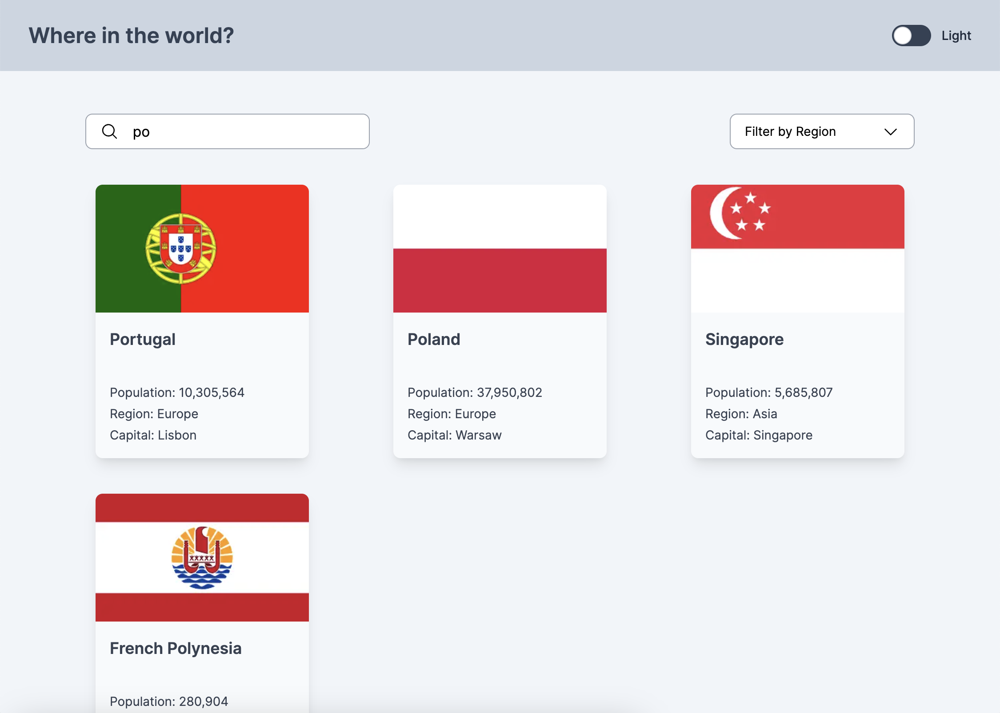
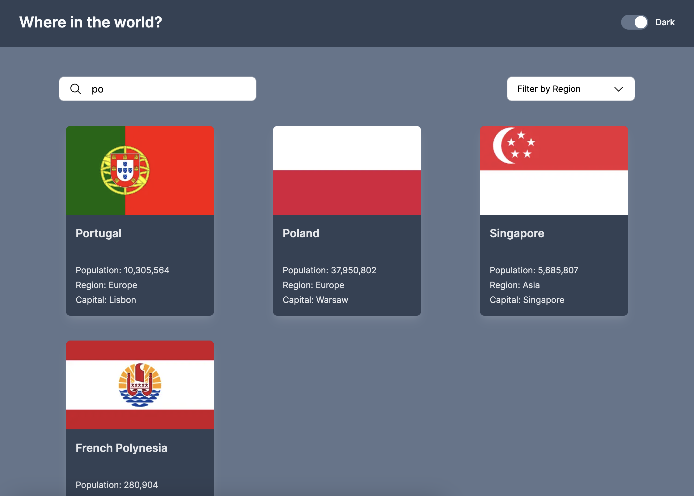
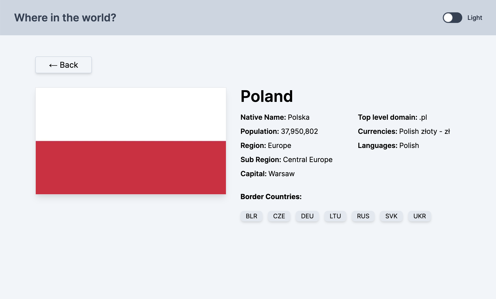
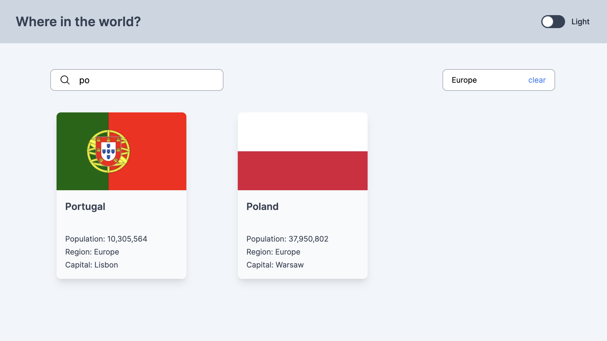

# REST Countries API

This is a Nextjs application that provides information about different countries using the REST Countries API. 

## Screenshots

### Light Theme

### Dark Theme

### Details Page

### Search and Filtering

## Live Site

Check out the live site [here]().

## Features

- View a list of countries
- Click on a country to view detailed information
- Search for a specific country by name
- Filter countries by region
- Choose between dark and light themes for a personalized experience
- Jump another country from the detail page (using border country list)
- System stores your latest search value and filter value when you go back to the main page

## Tech Stack

The project is built using the following technologies:

- React: A JavaScript library for building user interfaces.
- Nextjs: A javascript framework works top on the React and uses all the benefits of React. It helps for SSG, SSR and routing.
- Tailwind CSS: A utility-first CSS framework that enables rapid UI development with pre-defined styles and components.
- Typescript: Type safe version of Javascript.

## Installation and Usage

- Clone the repository: `git clone https://github.com/mehmetakifakkus/rest-api-countries.git`
- Navigate to the project directory: `cd rest-api-countries`
- Run `npm install` to install project dependencies.
- Run `npm run dev` to start the development server.
- Open your browser and visit `http://localhost:3000` (or the specified port) to view the application.

## Folder Structure

- `app`: Contains the source code of the Nextjs application. It uses Nextjs app router.
  - `page.tsx`: Entry point of the application that runs when routing is `/`.
  - `[id]`: This is a routing for details page of the country runs when routing is `/Germany`.
  - `components`: Contains reusable React components used throughout the application.
  - `globals.css`: Contains Tailwind directives and custom styles for the application.
  - `Homepage.tsx`: Main component of the application.
  - `context`: It contains hooks used in the application. Theme context is used for storing light/dark mode throughout the application.
  - `hooks`: It includes custom hooks.
  - `lib`: This folder includes all the utilities and some fetching functions.

## Deployment

To deploy the application to production, run `npm run build`. This will create an optimized build in the dist folder, which can be deployed to a web server or hosting service of your choice.

## Contributing

Contributions to the project are welcome! Feel free to open issues and pull requests for bug fixes, improvements, or new features.

## License

This project is licensed under the [MIT License](LICENSE).